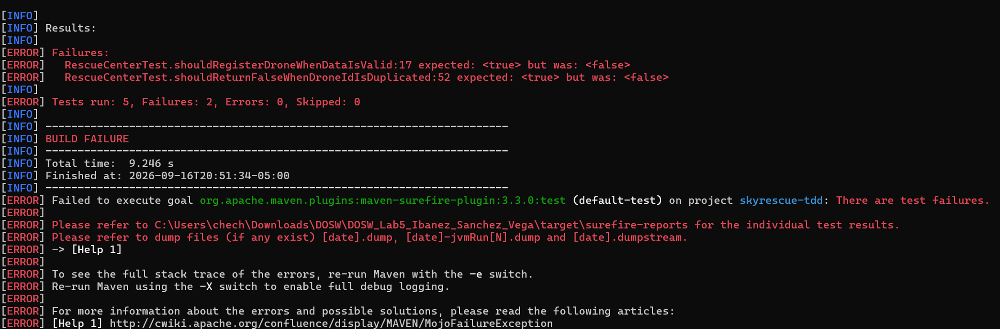
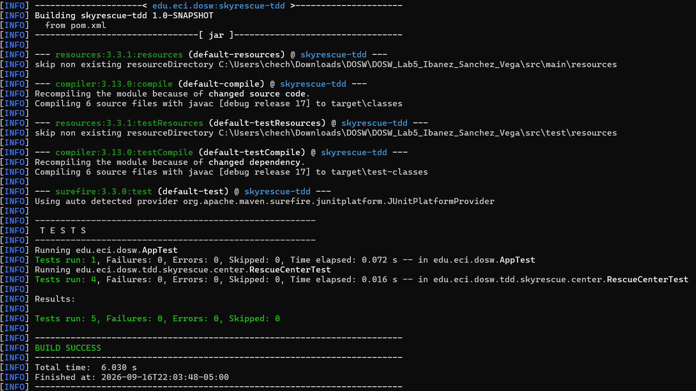
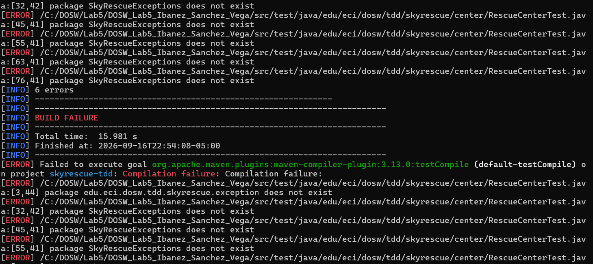
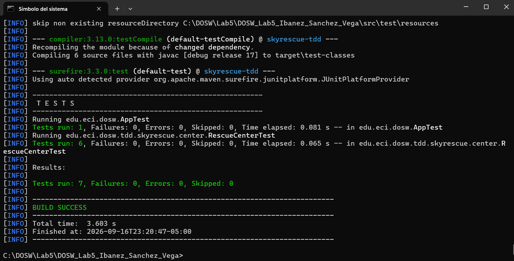
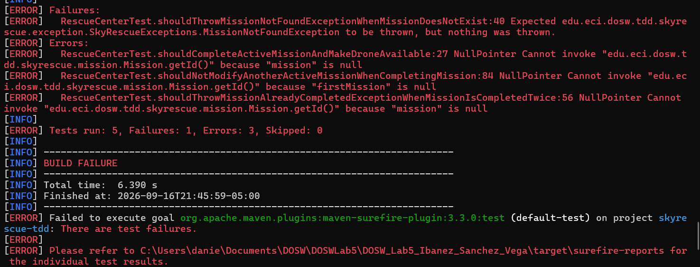
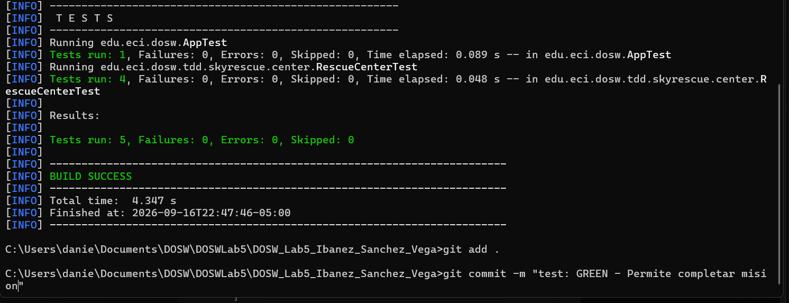
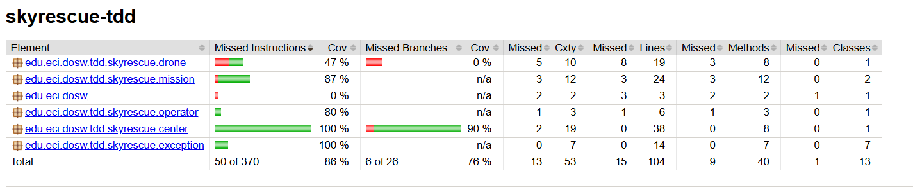
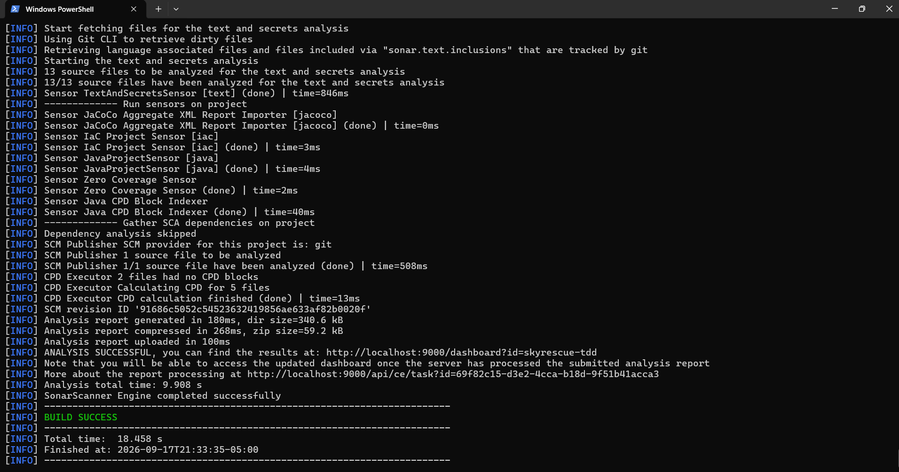
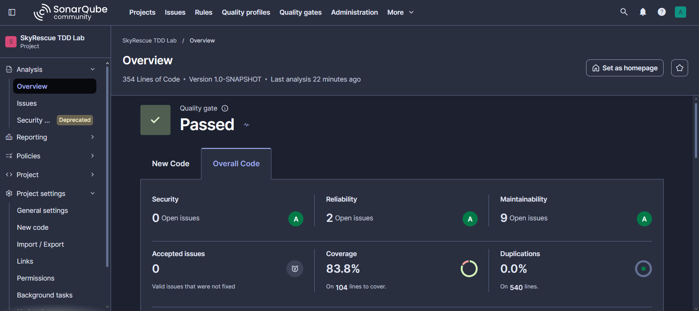

# DOSW_Lab5_Ibanez_Sanchez_Vega

## 10.1 Integrantes

| Nombre |
| :--- | 
| **Yazid Sánchez** | 
| **Daniel Ibáñez** | 
| **Sergio Vega** | 

## 10.2 Descripción de SkyRescue

| Aspecto | Descripción |
| :--- | :--- |
| **Problema que resuelve** | Optimiza y coordina el despacho de drones para asistir en operaciones de emergencia, transportando suministros vitales a zonas de difícil acceso de manera segura. |
| **Reglas del Dominio** | 1. Un dron no puede exceder su distancia máxima de autonomía. 2. Un operador solo puede tener una misión activa a la vez. 3. No se pueden asignar drones ocupados ni cerrar misiones ya completadas. |
| **Operaciones (TDD)** | - `addDrone`: Registra nuevos drones validando IDs únicos y datos no nulos. - `assignMission`: Asigna misiones verificando disponibilidad y distancias. - `completeMission`: Finaliza misiones activas y libera los drones. |

## 10.3 Evidencia TDD

A continuación se documenta un ciclo completo de Test-Driven Development (TDD) para cada una de las tres operaciones principales del centro de rescate.

### Ciclo 1: 'addDrone' 
| Fase | Estado | Evidencia |
| :---: | :---: | :--- |
| **RED** |  Falla |   | 
| **GREEN** |  Pasa |  |

### Ciclo 2: 'assignMission' 

| Fase | Estado | Evidencia |
| :---: | :---: | :--- |
| **RED** |  Falla |   | 
| **GREEN** |  Pasa |   | 

### Ciclo 3: 'completeMission' 

| Fase | Estado | Evidencia |
| :---: | :---: | :--- |
| **RED** |  Falla |   | 
| **GREEN** |  Pasa |   |

## 10.4 Cobertura (JaCoCo)

| Métrica de Cobertura | Captura de Pantalla |
| :--- | :--- |
| **Primera Ejecución** |   |
| **Ejecución Final (>= 85%)** |   |

---

## 10.5 Análisis (SonarQube)

| Requisitos de Aprobación | Dashboard de Evidencia |
| :--- | :--- |
|   |   |

## 10.6 Flujo Git y Pull Requests

| PR # | Componente / Funcionalidad | Enlace al repositorio |
| :---: | :--- | :--- |
| **#1** | Configuración de JUnit 5 en el `pom.xml` | `(https://github.com/Zixer/DOSW_Lab5_Ibanez_Sanchez_Vega/pull/1)` |
| **#2** | Creación de las clases base | `(https://github.com/Zixer/DOSW_Lab5_Ibanez_Sanchez_Vega/pull/2)` |
| **#3** | Desarrollo TDD para `addDrone` | `(https://github.com/Zixer/DOSW_Lab5_Ibanez_Sanchez_Vega/pull/3)` |
| **#4** | Desarrollo TDD para `assignMission` | `(https://github.com/Zixer/DOSW_Lab5_Ibanez_Sanchez_Vega/pull/4)` |
| **#5** | Desarrollo TDD para `completeMission` | ` (https://github.com/Zixer/DOSW_Lab5_Ibanez_Sanchez_Vega/pull/5)` |
| **#6** | Integración del plugin de JaCoCo | `(https://github.com/Zixer/DOSW_Lab5_Ibanez_Sanchez_Vega/pull/6)` |
| **#7** | Integración y correcciones de SonarQube | `No se consideró un pull request importante, debido a que estos fueron únicamente pruebas y no se realizó agregación de archivos, debido a que es un sistema externo a Github :p` |

## 10.7 Reflexión Técnica

| # | Pregunta | Respuesta del Equipo |
| :---: | :--- | :--- |
| **1** | ¿Qué error o comportamiento inesperado fue detectado primero gracias a una prueba? | Como cada uno realizó un push en una distinta rama, nos dimos cuenta que en ciertas ocaciones se requerían los códigos de los otros compáñeros para el correcto funcionamiento del propio, lo cual implicó que nos vieramos en la necesidad de implementarlos para que estos pasaran las pruebas de manera exitosa.  |
| **2** | ¿Qué parte del código cambió durante REFACTOR sin modificar el comportamiento? | No se realizaron refactors, por ende, no se puede contestar esta pregunta.  |
| **3** | ¿Qué casos adicionales aparecieron al revisar la cobertura? | El reporte de JaCoCo nos mostró que no estábamos evaluando los métodos de dronequals, hashcode y getModel. |
| **4** | ¿Qué hallazgo de SonarQube produjo un cambio real en el código? | A pesar de que no implementamos los cambios, SonarQube detectó deudas técnicas que se pudieron haber corregido:  1. Pasar explícitamente una zona horaria al usar `LocalDateTime.now()`. 2. Eliminar modificadores de visibilidad redundantes en las pruebas de JUnit 5. 3. Reemplazar el uso de `System.out` por un *logger* adecuado. Entre otros cambios a realizar. |

## 10.? Prompts

| # | Prompts | Proposito del Prompt |
| :---: | :--- | :---- |
| **1** | ¿Cómo se instala SonarQube en mi pc? | No sabíamos instalar SonarCube, por ende, acudimos a la IA para que nos ayude con el paso a paso de la instalación de este. |
